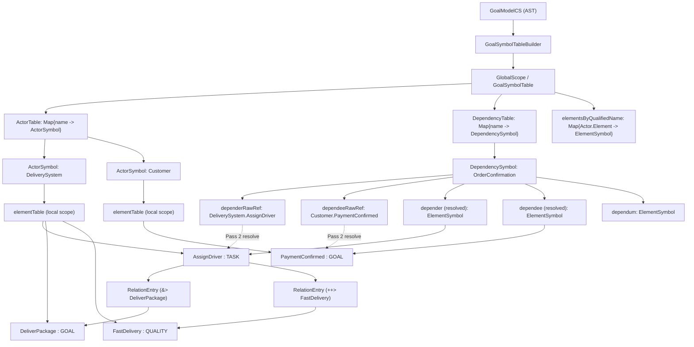
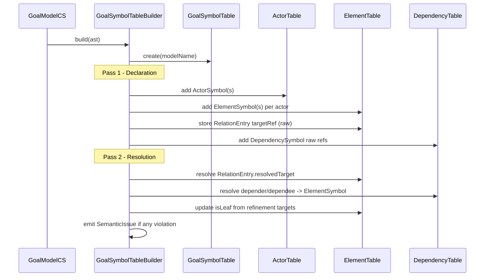
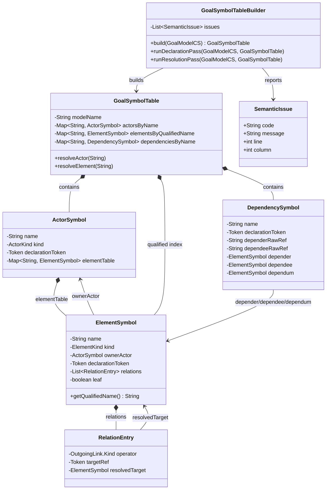

# Đặc tả Symbol Table — Ngôn ngữ GOAL

> Tài liệu tham khảo nội bộ cho giai đoạn Semantic Analysis của compiler GOAL.

---

## 1. Tổng quan kiến trúc

Symbol Table của GOAL có **2 tầng lồng nhau**, phản ánh đúng cấu trúc phạm vi (scope) của ngôn ngữ:

```
GlobalScope
├── modelName: String
├── ActorTable:      { name → ActorSymbol }
└── DependencyTable: { name → DependencySymbol }
```

Mỗi `ActorSymbol` lại chứa một bảng con:

```
ActorSymbol
└── ElementTable: { name → ElementSymbol }
```

---

## 2. Các loại Symbol

### 2.1 `ActorSymbol`

Đại diện cho khai báo `actor`, `agent`, hoặc `role`.

| Trường | Kiểu | Mô tả |
|---|---|---|
| `name` | `String` | Tên định danh của tác nhân |
| `kind` | `ACTOR \| AGENT \| ROLE` | Phân loại tác nhân |
| `parent` | `ActorSymbol?` | Tác nhân cha trong quan hệ `is-a` (`:`) |
| `participatesIn` | `ActorSymbol?` | Tác nhân được tham gia trong quan hệ `participates-in` (`>`) |
| `elementTable` | `Map<String, ElementSymbol>` | Bảng các phần tử chủ đích bên trong |
| `sourceLocation` | `Location` | Vị trí trong mã nguồn (dòng, cột) |

**Ràng buộc quan hệ tổ chức:**

| Quan hệ | Ký hiệu | Kiểu nguồn hợp lệ | Kiểu đích hợp lệ |
|---|---|---|---|
| is-a | `:` | `ACTOR` | `ACTOR` |
| is-a | `:` | `ROLE` | `ROLE` |
| participates-in | `>` | `AGENT` | `ROLE` |
| participates-in | `>` | `AGENT` | `AGENT` |

---

### 2.2 `ElementSymbol`

Đại diện cho `goal`, `task`, `quality`, hoặc `resource` bên trong một tác nhân.

| Trường | Kiểu | Mô tả |
|---|---|---|
| `name` | `String` | Tên định danh phần tử |
| `kind` | `GOAL \| TASK \| QUALITY \| RESOURCE` | Phân loại phần tử |
| `ownerActor` | `ActorSymbol` | Tác nhân sở hữu phần tử này |
| `description` | `String?` | Nội dung thuộc tính `description = "..."` nếu có |
| `isLeaf` | `Boolean` | `true` nếu phần tử chưa bị phân rã (refined) — xem mục 4 |
| `relations` | `List<RelationEntry>` | Danh sách các quan hệ xuất phát từ phần tử này |
| `goalContract` | `GoalContract?` | Hợp đồng mục tiêu OCL (`maintain` / `avoid` / `achieve`) |
| `taskContract` | `TaskContract?` | Hợp đồng tác vụ OCL (`pre` / `post`) |
| `sourceLocation` | `Location` | Vị trí trong mã nguồn |

---

### 2.3 `RelationEntry`

Một mục quan hệ gắn vào `ElementSymbol` nguồn. Mỗi phần tử có thể có nhiều `RelationEntry` (phân tách bằng dấu `,` trong mã nguồn).

| Trường | Kiểu | Mô tả |
|---|---|---|
| `operator` | `OperatorKind` | Loại toán tử quan hệ |
| `targetRef` | `String` | Tên đích thô từ AST, ví dụ `"FastDelivery"` hoặc `"DeliverySystem.AssignDriver"` |
| `resolvedTarget` | `ElementSymbol?` | Điền sau Pass 2 — kết quả tra cứu symbol |
| `sourceLocation` | `Location` | Vị trí trong mã nguồn |

**Enum `OperatorKind`:**

| Giá trị | Ký hiệu trong code | Nhóm |
|---|---|---|
| `AND_REFINE` | `&>` | Refinement |
| `OR_REFINE` | `\|>` | Refinement |
| `MAKE` | `++>` | Contribution |
| `HELP` | `+>` | Contribution |
| `HURT` | `->` | Contribution |
| `BREAK` | `-->` | Contribution |
| `QUALIFY` | `=>` | Qualification |
| `NEEDED_BY` | `<>` | NeededBy |

---

### 2.4 `DependencySymbol`

Đại diện cho một khối `dependency` khai báo ở cấp global.

| Trường | Kiểu | Mô tả |
|---|---|---|
| `name` | `String` | Tên định danh của dependency |
| `depender` | `ElementSymbol` | Phần tử đang cần sự trợ giúp (đã resolve) |
| `dependee` | `ElementSymbol` | Phần tử cung cấp sự trợ giúp (đã resolve) |
| `dependum` | `ElementSymbol` | Phần tử trung gian nội tuyến (`goal`/`task`/`resource`/`quality`) |
| `sourceLocation` | `Location` | Vị trí trong mã nguồn |

**Ràng buộc:** `depender` và `dependee` phải là **leaf element** (`isLeaf = true`). Xem mục 4.

---

### 2.5 `GoalContract`

Phần mở rộng OCL gắn vào `ElementSymbol` có `kind = GOAL`.

| Trường | Kiểu | Mô tả |
|---|---|---|
| `type` | `MAINTAIN \| AVOID \| ACHIEVE` | Loại vị từ mục tiêu |
| `variable` | `String?` | Biến lặp trong `achieve for unique (s: T, ...)` |
| `expression` | `OclExpr` | Cây biểu thức OCL |

---

### 2.6 `TaskContract`

Phần mở rộng OCL gắn vào `ElementSymbol` có `kind = TASK`.

| Trường | Kiểu | Mô tả |
|---|---|---|
| `precondition` | `OclExpr?` | Biểu thức điều kiện tiền quyết (`pre:`) |
| `postcondition` | `OclExpr?` | Biểu thức điều kiện hậu quyết (`post:`) |

---

## 3. Ma trận hợp lệ Nguồn–Đích (Operator Validation Matrix)

Dùng để kiểm tra semantic sau khi resolve. Ô `✓` = hợp lệ, ô `✗` = lỗi semantic.

| **Nguồn \ Đích** | `GOAL` | `QUALITY` | `TASK` | `RESOURCE` |
|---|---|---|---|---|
| `GOAL` | `&>` `\|>` (Refinement) | `++>` `+>` `->` `-->` (Contribution) | `&>` `\|>` (Refinement) | ✗ |
| `QUALITY` | `=>` (Qualification) | `++>` `+>` `->` `-->` (Contribution) | `=>` (Qualification) | `=>` (Qualification) |
| `TASK` | `&>` `\|>` (Refinement) | `++>` `+>` `->` `-->` (Contribution) | `&>` `\|>` (Refinement) | ✗ |
| `RESOURCE` | ✗ | `++>` `+>` `->` `-->` (Contribution) | `<>` (NeededBy) | ✗ |

---

## 4. Quy tắc xác định `isLeaf`

`isLeaf` được tính trong **Pass 1**, dựa vào việc phần tử có xuất hiện ở **phía đích** của quan hệ Refinement hay không.

```
Với mỗi RelationEntry (op=AND_REFINE hoặc op=OR_REFINE):
    target.isLeaf = false
    
Mặc định ban đầu: tất cả ElementSymbol.isLeaf = true
```

**Ví dụ:**

```
task AssignDriver &> DeliverPackage { }   // → DeliverPackage.isLeaf = false
task VerifyDriverLicense &> AssignDriver { } // → AssignDriver.isLeaf = false
resource DriverDatabase <> AssignDriver { }  // AssignDriver đích của <>, không ảnh hưởng isLeaf
```

Kết quả:
- `DeliverPackage` → `isLeaf = false`
- `AssignDriver` → `isLeaf = false`
- `VerifyDriverLicense` → `isLeaf = true`
- `DriverDatabase` → `isLeaf = true`

---

## 5. Quy trình xây dựng (2 Pass)

### Pass 1 — Declaration Pass

Duyệt toàn bộ AST, **chỉ tạo symbol, chưa resolve tham chiếu**.

```
1. Tạo GlobalScope
2. Với mỗi actor/agent/role declaration:
   a. Tạo ActorSymbol, thêm vào ActorTable
   b. Với mỗi element bên trong:
      - Tạo ElementSymbol (isLeaf = true mặc định)
      - Thêm vào elementTable của actor
      - Lưu relations thô (targetRef là string)
3. Với mỗi dependency declaration:
   - Tạo DependencySymbol (depender/dependee/dependum chưa resolve)
   - Thêm vào DependencyTable
4. Cập nhật isLeaf:
   - Duyệt lại tất cả relations có op=AND_REFINE hoặc OR_REFINE
   - Đánh dấu target.isLeaf = false (tra cứu trong cùng actor scope)
```

### Pass 2 — Resolution Pass

Sau Pass 1, toàn bộ symbol đã tồn tại. Tiến hành resolve tham chiếu.

```
1. Với mỗi RelationEntry trong toàn bộ ElementSymbol:
   a. Parse targetRef:
      - Nếu dạng "ElementName": tìm trong elementTable của actor hiện tại
      - Nếu dạng "ActorName.ElementName": tìm actor trước, rồi element trong actor đó
   b. Gán resolvedTarget
   c. Nếu không tìm thấy → ERROR: Undeclared reference

2. Với mỗi DependencySymbol:
   a. Resolve depender (dạng "ActorName.ElementName")
   b. Resolve dependee (dạng "ActorName.ElementName")
   c. Kiểm tra isLeaf của depender và dependee → nếu false → ERROR

3. Với actor relationships (is-a, participates-in):
   a. Resolve tên tác nhân đích → ActorSymbol
   b. Kiểm tra ràng buộc kiểu (xem bảng mục 2.1)
```

---

## 6. Danh sách Semantic Checks

Sau khi hoàn thành 2 pass, thực hiện các kiểm tra sau:

| # | Tên lỗi | Điều kiện phát hiện |
|---|---|---|
| S1 | `UndeclaredReference` | `resolvedTarget = null` sau Pass 2 |
| S2 | `InvalidOperatorMatrix` | Cặp `(source.kind, target.kind, operator)` không có trong ma trận mục 3 |
| S3 | `DependencyOnNonLeaf` | `depender.isLeaf = false` hoặc `dependee.isLeaf = false` |
| S4 | `InvalidActorRelationship` | Vi phạm ràng buộc kiểu trong bảng mục 2.1 |
| S5 | `DuplicateDeclaration` | Hai symbol cùng tên trong cùng scope |
| S6 | `SelfReference` | `resolvedTarget = sourceElement` (phần tử tự quan hệ với chính nó) |
| S7 | `QualifySourceNotQuality` | Toán tử `=>` dùng với nguồn không phải `QUALITY` |
| S8 | `NeededBySourceNotResource` | Toán tử `<>` dùng với nguồn không phải `RESOURCE` |

---

## 7. Ví dụ minh họa

### Mã nguồn

```
istar SmartDelivery

agent DeliverySystem {
    goal DeliverPackage { description = "Hoan thanh viec giao hang" }
    quality HighReliability { }
    quality FastDelivery +> HighReliability { }
    task ProcessOrder &> DeliverPackage { }
    task AssignDriver &> DeliverPackage, ++> FastDelivery { }
    task VerifyDriverLicense &> AssignDriver { }
    resource DriverDatabase <> AssignDriver { }
    quality SystemSecurity => DriverDatabase { }
}
```

### Symbol Table kết quả

```
GlobalScope
├── modelName: "SmartDelivery"
└── ActorTable:
    └── "DeliverySystem": ActorSymbol {
            kind: AGENT,
            elementTable: {
                "DeliverPackage": ElementSymbol {
                    kind: GOAL,
                    isLeaf: false,          ← bị AssignDriver và ProcessOrder trỏ vào
                    description: "Hoan thanh viec giao hang",
                    relations: []
                },
                "HighReliability": ElementSymbol {
                    kind: QUALITY,
                    isLeaf: true,
                    relations: []
                },
                "FastDelivery": ElementSymbol {
                    kind: QUALITY,
                    isLeaf: true,
                    relations: [
                        { op: HELP, targetRef: "HighReliability",
                          resolvedTarget: → HighReliability }
                    ]
                },
                "ProcessOrder": ElementSymbol {
                    kind: TASK,
                    isLeaf: true,
                    relations: [
                        { op: AND_REFINE, targetRef: "DeliverPackage",
                          resolvedTarget: → DeliverPackage }
                    ]
                },
                "AssignDriver": ElementSymbol {
                    kind: TASK,
                    isLeaf: false,          ← bị VerifyDriverLicense trỏ vào
                    relations: [
                        { op: AND_REFINE, targetRef: "DeliverPackage",
                          resolvedTarget: → DeliverPackage },
                        { op: MAKE,       targetRef: "FastDelivery",
                          resolvedTarget: → FastDelivery }
                    ]
                },
                "VerifyDriverLicense": ElementSymbol {
                    kind: TASK,
                    isLeaf: true,
                    relations: [
                        { op: AND_REFINE, targetRef: "AssignDriver",
                          resolvedTarget: → AssignDriver }
                    ]
                },
                "DriverDatabase": ElementSymbol {
                    kind: RESOURCE,
                    isLeaf: true,
                    relations: [
                        { op: NEEDED_BY, targetRef: "AssignDriver",
                          resolvedTarget: → AssignDriver }
                    ]
                },
                "SystemSecurity": ElementSymbol {
                    kind: QUALITY,
                    isLeaf: true,
                    relations: [
                        { op: QUALIFY, targetRef: "DriverDatabase",
                          resolvedTarget: → DriverDatabase }
                    ]
                }
            }
        }
```

---

*Tài liệu này được tạo phục vụ môn học Nguyên lý Ngôn ngữ Lập trình — ĐH Công nghệ, ĐHQGHN — 2025.*

---

## 8. Biểu đồ tương tác giữa các bảng

### 8.1 Quan hệ dữ liệu (sau Pass 2)



### 8.2 Trình tự dựng bảng (Pass 1 -> Pass 2)



### 8.3 Ghi nhớ nhanh

- `ActorTable` quản lý namespace tác nhân ở mức global.
- `elementTable` trong từng `ActorSymbol` quản lý namespace local của phần tử.
- `elementsByQualifiedName` là chỉ mục tra cứu chéo nhanh cho dạng `Actor.Element`.
- `RelationEntry.targetRef` là dữ liệu thô từ source; `resolvedTarget` là kết quả sau Pass 2.
- `DependencySymbol` giữ cả raw refs và resolved refs để debug semantic dễ hơn.

### 8.4 Quan hệ giữa các class trong folder `symbols`



Tóm tắt tổ chức:

- `GoalSymbolTable` là object trung tâm chứa toàn bộ bảng tra cứu.
- `GoalSymbolTableBuilder` là lớp dựng bảng theo 2 pass và ghi nhận lỗi `SemanticIssue`.
- `ActorSymbol` sở hữu bảng `elementTable` (scope cục bộ theo actor).
- `ElementSymbol` vừa biết owner actor, vừa giữ danh sách `RelationEntry`.
- `RelationEntry` ban đầu giữ ref thô (`targetRef`), sau resolve sẽ trỏ `resolvedTarget`.
- `DependencySymbol` giữ cả raw refs và các liên kết đã resolve để phục vụ semantic checks.